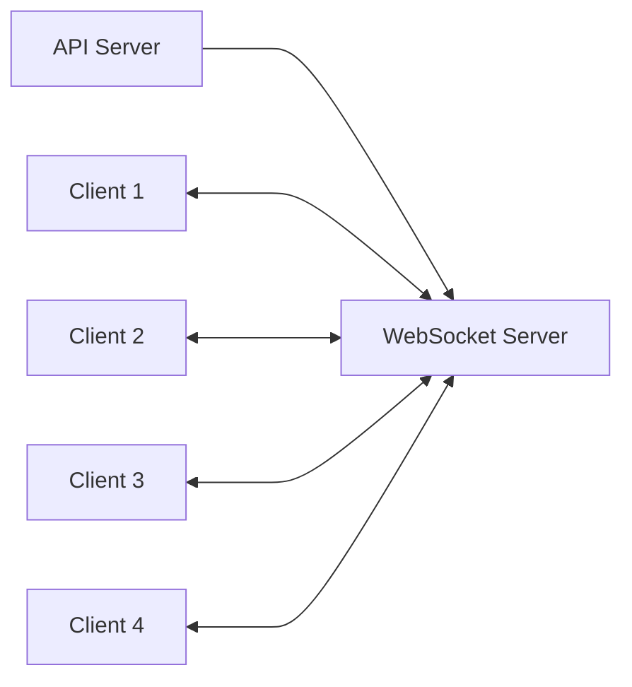
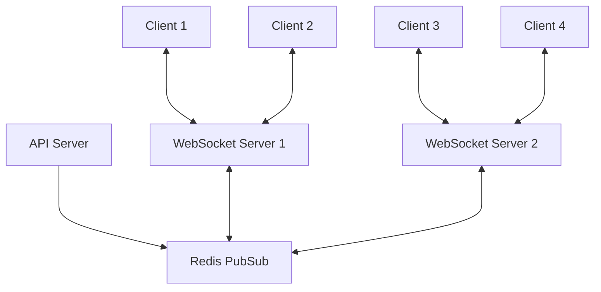
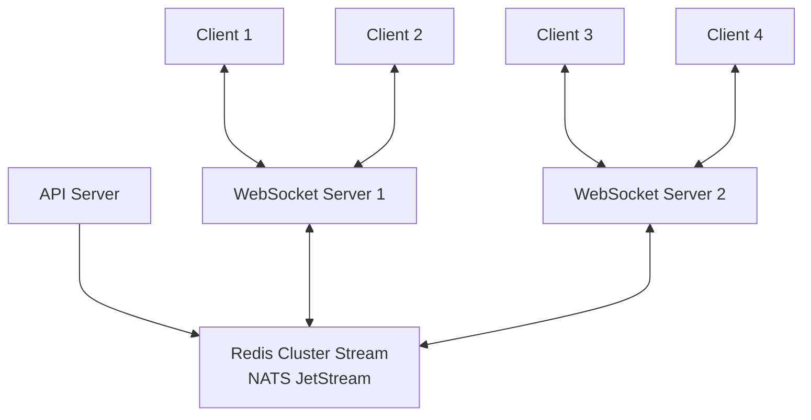
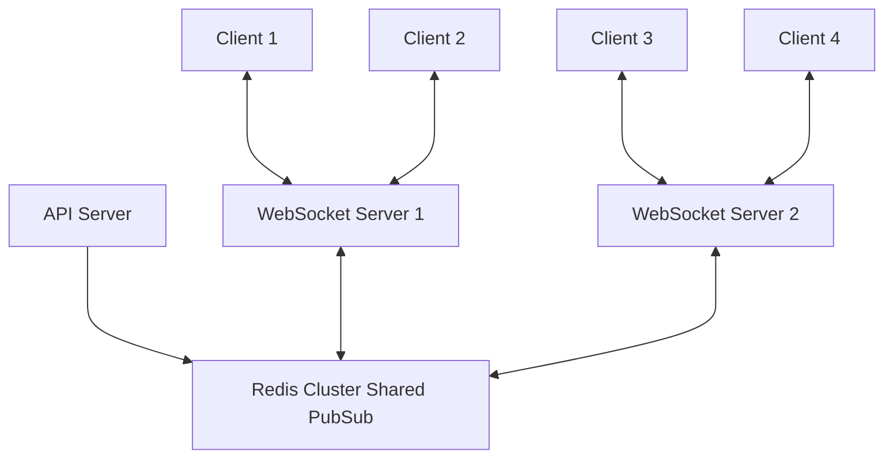
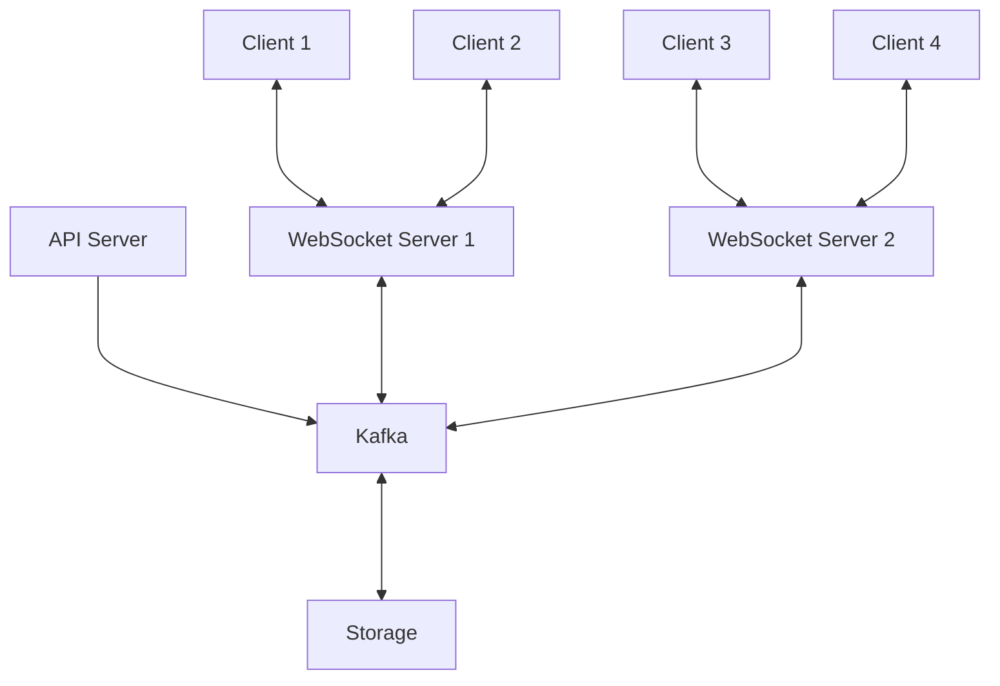

# はじめに

現代のWebアプリケーションでは、リアルタイム性がとても重要な要素になっています。チャットアプリ、通知システム、リアルタイムダッシュボード、オンラインゲームなど、ユーザーに即時に情報を届けることが求められるケースが増えています。

そんなリアルタイム通信を実現するために、WebSocketは非常に強力な武器となります。しかしWebSocketを単体で使うだけでは、アプリケーションが大きくなったり要件が複雑になったりすると、だんだん限界が見えてきます。とくにシステムの規模が拡大して、メッセージの信頼性や永続性が重要になってくると、もう少し工夫が必要になってきます。

この記事では、WebSocketを使ったリアルタイムメッセージ配信の仕組みについて、シンプルな構成から段階的に複雑な要件に対応できるアーキテクチャまで、色々なパターンを見ていきましょう。それぞれのパターンの良いところ・悪いところを比較しながら、「こんな要件ならこのパターンがオススメ」というヒントを提供できればと思います。

# WebSocketによるリアルタイム通信の基礎

WebSocketは、クライアントとサーバー間で双方向通信ができるプロトコルです。普通のHTTP通信と違って、一度接続が確立されると、その接続を維持したまま双方向でデータをやり取りできます。

## WebSocketの特徴

- **双方向通信**: サーバーからクライアントへ「プッシュ」で情報を送れます
- **低レイテンシー**: コネクションを維持するので、通信のムダが少なくて済みます
- **リアルタイム性**: 何か起きたらすぐにデータを送れるので、とても「今」を伝えられます

WebSocketサーバーは単体でも十分動作しますが、複数のサーバーで負荷分散したい場合や、メッセージの信頼性をもっと高めたい場合には、追加の仕組みが必要になってきます。

# メッセージ配信パターンの理解

リアルタイムメッセージ配信を設計する際に理解すべき重要な概念として、「ファンアウトパターン」と「キューパターン」があります。

## ファンアウトパターン

ファンアウトパターンでは、メッセージは発行された時点で接続中のすべての購読者に即時配信されます。メッセージは一時的なもので、配信後は保持されません。

**代表的な実装:**
- Redis PubSub
- MQTT Broker

**特徴:**
- シンプルで低レイテンシー
- メッセージの永続化なし
- 配信時に接続していないクライアントはメッセージを受け取れない

## キューパターン

キューパターンでは、メッセージはキューに保存され、コンシューマーが明示的に取得するまで保持されます。

**代表的な実装:**
- Redis Stream
- Apache Kafka
- Google Cloud Pub/Sub

**特徴:**
- メッセージの永続化
- 非同期処理が可能
- 配信保証の実装が可能
- クライアントが一時的にオフラインでも後でメッセージを取得可能

# メッセージ配信の品質保証

メッセージングシステムを設計する時、「どれくらい確実にメッセージを届けるか」という **メッセージ配信の品質（Quality of Service、QoS）** がとても大切になります。

| 配信保証 | 説明 | 特徴 | 実装難易度 | 運用難易度 | 適したユースケース |
|---------|------|------|-----------|-----------|-----------------|
| **At Most Once** （最大一回） | メッセージは一度だけ配信されるか、まったく配信されない可能性がある | ・**もっともシンプルで高パフォーマンス** ・メッセージ損失の可能性あり | ★☆☆ | ★☆☆ | 重要でない通知や、損失しても問題ないデータ |
| **At Least Once** （最低一回） | メッセージは少なくとも1回は配信されるが、重複して配信される可能性がある | ・**メッセージ損失はないが重複の可能性あり** ・受信側で重複排除処理が必要 | ★★☆ | ★★☆ | 一般的なメッセージング、多くのユースケース |
| **Exactly Once** （厳密に一回） | メッセージは必ず一度だけ配信される | ・**もっとも信頼性が高い** ・実装が複雑でパフォーマンスコストが高い | ★★★ | ★★★ | 金融取引など、高い正確性が求められる場面 |

# 段階的実装パターンの比較

それでは、さまざまな要件に対応するWebSocketメッセージ配信の構成パターンを見ていきましょう。規模や要件によって、どんな選択肢があるのか、順番に解説します。

## シンプルパターン（WebSocket Serverのみ）

一番シンプルな構成は、**WebSocketサーバー1台でクライアントとの通信を全部まかなう**形です。小さなアプリケーションなら、これで十分でしょう。

**メリット:**
- **実装が簡単**で、すぐに始められます
- レスポンスが早くて軽快に動きます
- 余計な仕組みが要らないのでシンプル

**デメリット:**
- **スケーラビリティに制限がある**ので、ユーザーが増えると厳しいかも
- サーバーがダウンすると全部の接続が切れてしまいます
- クライアント間のメッセージのやり取りに工夫が必要

**適したユースケース:**
- 小規模なアプリケーション
- とりあえず試してみたいプロトタイプ
- 同時接続数が少ない場合

## WebSocketスケールアウトパターン（WebSocket + Redis PubSub）

WebSocketサーバーを複数インスタンスに拡張し、**Redis PubSubを使用してサーバー間でメッセージを同期**します。

**メリット:**
- **水平スケーリングが可能**
- サーバー障害時の影響を軽減
- 実装が比較的シンプル

**デメリット:**
- メッセージの永続化がない
- オフラインクライアントへの配信ができない
- 単体のRedisはスケールアウトができないので、大規模なアプリケーションには向かない
- **Redis PubSub制限**: Redis Clusterを使用しても、PubSub機能自体はクラスター間で自動的にスケールアウトされず、全ノード間でメッセージが共有されない制限がある

**適したユースケース:**
- 中規模のリアルタイムアプリケーション
- チャットやステータス更新など、一時的なメッセージング

## バックエンド処理スケールアウトパターン（WebSocket + Redis Cluster/NATS JetStream）

WebSocketサーバーに加えて、**バックエンド処理もスケールアウトできる構成**です。Redis ClusterやNATS JetStreamを使用して、メッセージの処理と配信を分散化します。

**[NATS JetStream](https://docs.nats.io/nats-concepts/jetstream)とは**:
NATS JetStreamはRedisよりも水平スケーリングが容易で、スループット性能が高いメッセージングシステムです。とくに大規模分散システムでの高スループット処理に適しており、ストリーム処理、永続化、アクノリッジメントなどの機能を提供します。学習コストと運用負荷はRedisよりやや高めですが、大規模システムでのスケーラビリティでは優位性があります。

**メリット:**
- バックエンド処理の水平スケーリング
- 部分的なメッセージ永続化
- 障害耐性の向上
- NATS JetStreamを使用する場合はとくに高いスループットと水平スケーラビリティ

**デメリット:**
- 構成が複雑化
- 運用コストの増加
- 完全なExactly Onceの保証は難しい
- NATS JetStreamの場合、Redisと比べて学習コストが高い

**適したユースケース:**
- 大規模なリアルタイムアプリケーション
- 処理の遅延が許容できるメッセージング
- 高いスループットが要求されるシステム

## 全クライアントブロードキャストパターン（WebSocket + Redis Cluster Shared PubSub）

全クライアントへのブロードキャスト配信が必要な場合、**Redis ClusterのShared PubSub機能を使用した構成が効果的**です。キュー型のメッセージングシステム（Kafka、RabbitMQなど）では、同一メッセージの複数コンシューマーへの配信が基本的にできないため、ブロードキャストには適していません。

また通常のシングルのRedisサーバ上でPubSubを使ってもブロードキャストは実現できますが、特定のチャネルへのメッセージにもかかわらずすべての WebSocket サーバーにメッセージが配信されてしまい不要な通信が発生してしまいます。他には、Redis Cluster + PubSubの場合だとeast-westトラフィック（ノード間通信）が指数関数的に増加する問題があります。([同時接続数30万超のチャットサービスのメッセージ配信基盤をRedis Pub/SubからRedis Streamsにした話](https://engineering.linecorp.com/ja/blog/redis-pub_Sub-redis-streams))

**メリット:**
- 効率的な全体ブロードキャスト
- スケーラブルな構成
- メッセージングの柔軟性
- ノード間通信の最適化

**デメリット:**
- 複雑なインフラストラクチャ
- ネットワークトラフィックの増加
- 運用・監視の負荷
- クラスター管理の複雑さと運用オーバーヘッド

**適したユースケース:**
- ライブイベント配信
- 全ユーザーへの通知
- リアルタイムダッシュボード更新

## 高度なメッセージングパターン（Kafkaの活用）

より高度な要件に対応するため、**Kafkaなどの専用メッセージングシステムを導入**します。このパターンでは、**メッセージは永続化されてストレージに保存**され、データの分析、監査、長期アーカイブなどにも活用できます。

**メリット:**
- **高い信頼性と耐久性**
- 複雑なルーティングパターン
- **Exactly Onceの配信保証**
- メッセージの長期保存と履歴追跡

**デメリット:**
- **実装・運用の複雑さ**
- リソース消費が大きい
- 学習コストが高い

**潜在的なボトルネック:**
- **ディスクI/O性能がボトルネックになる可能性**があるため、SSDなどの高速ストレージを推奨
- クラスター管理の複雑さと運用オーバーヘッド
- 大量のトピックやパーティションを扱う場合のZookeeperへの負荷

**適したユースケース:**
- ミッションクリティカルなアプリケーション
- 複雑なイベント処理が必要なシステム
- 大規模分散システム
- データ分析や監査が必要なシステム

# まとめ

WebSocketを使ったリアルタイムメッセージ配信の仕組みを構築する際は、**アプリケーションの規模や要件に合わせて適切なアーキテクチャを選ぶことが大切**です。

- 小さなアプリケーションなら、**シンプルなWebSocketサーバーだけでOK**なケースが多いです
- ユーザーが増えてきたら、**Redis PubSubやStreamを使ってスケールアウト**するといいでしょう
- より高度な要件（確実なメッセージ配信や履歴保存など）が必要なら、**KafkaやRabbitMQといった専用メッセージングシステム**の導入を検討しましょう

大切なのは、「これが正解！」と決めつけるのではなく、**要件のトレードオフを考慮して選択する**こと。アプリケーションの成長に合わせて、**段階的に構成を進化させていく**アプローチが現実的だと思います。

リアルタイム通信は、現代のWebアプリケーションでますます重要になっています。この記事が、みなさんのアーキテクチャ設計の参考になれば嬉しいです！

# 備考：マネージドWebSocketサービスの選択肢

自分でWebSocketの仕組みを全部構築するのではなく、**クラウドサービスとして提供されているマネージドサービスを使う**という手もあります。これらのサービスを使えば、スケーリングや信頼性、セキュリティなどの面倒な部分を任せられるので、短期間で実装できるメリットがあります。

※使ったことはないので参考程度に・・・

## 代表的なマネージドWebSocketサービス

- **[Pusher](https://pusher.com/websockets/)**: 40以上の言語・プラットフォーム向けのSDKがあり、WebSocketの複雑な部分を隠してくれます。双方向通信やファイアウォールの通過、PubSubパターンなどが簡単に実装できて、ダッシュボードやプレゼンス機能、リアルタイムマップなども素早く作れます。

- **[PieSocket](https://piehost.com/piesocket)**: スケーラブルなWebSocketホスティングサービスで、シンプルなAPIとSDKが利用できます。

**メリット:**
- サーバー管理の手間がなく、開発に集中できます
- 短期間で機能を実装できます
- ユーザー増加にも自動的に対応してくれます
- 安定性と可用性が高いです

**デメリット:**
- 月額料金がかかります
- 自由にカスタマイズできる範囲に制限があります
- 一度使い始めると他に移行しづらくなることも
- データの保存場所や法令遵守に関する制約があることも

マネージドサービスは、とくに素早く始めたいプロトタイプや小〜中規模のアプリケーション、開発リソースが限られているプロジェクトに向いています。ただ、大規模なシステムや特殊な要件がある場合、長期的なコスト最適化が必要なケースでは、**自前のインフラ構築も検討する価値があります**。
