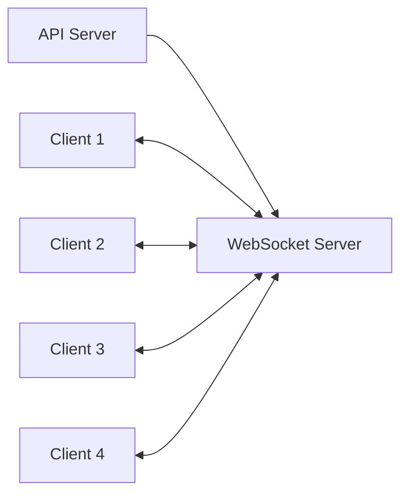
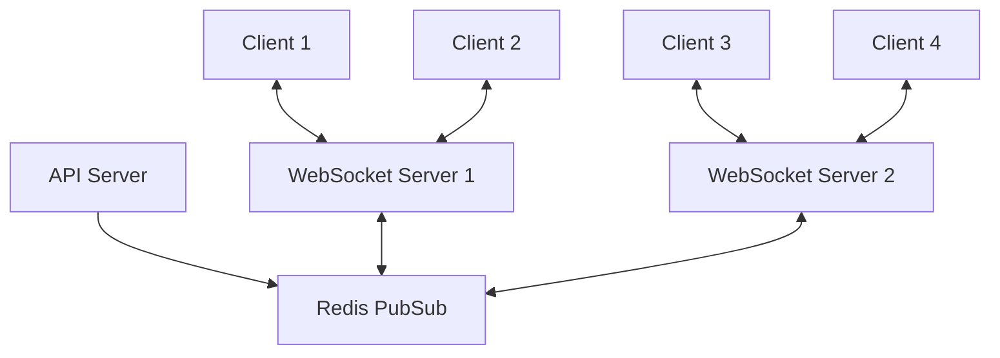
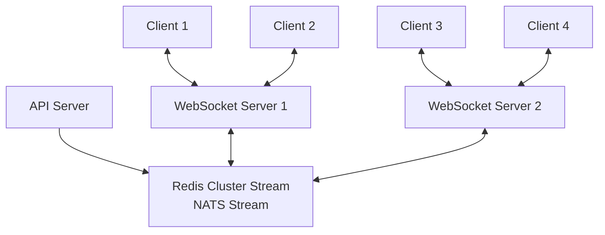
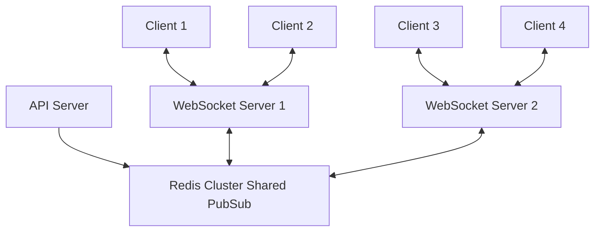
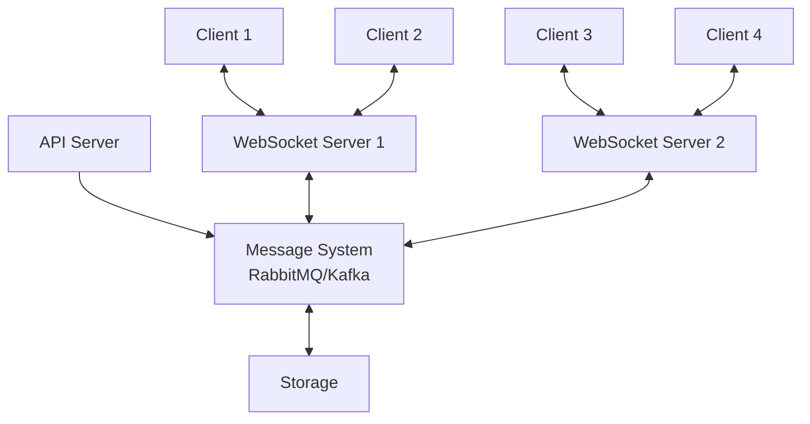

# はじめに

現代のWebアプリケーションにおいて、リアルタイム性は重要な要素となっています。チャットアプリ、通知システム、リアルタイムダッシュボード、オンラインゲームなど、多くのアプリケーションではユーザーへの即時的な情報配信が求められます。

こうしたリアルタイム通信の実現において、WebSocketは非常に強力なプロトコルです。しかし、WebSocketを単体で使用するだけでは、大規模なシステムや複雑な要件に対応することは難しくなります。とくにシステムの規模が拡大し、メッセージの信頼性や永続性が重要になるにつれて、より洗練されたアーキテクチャが必要になってきます。

この記事では、WebSocketを活用したリアルタイムメッセージ配信基盤について、シンプルな構成から段階的に複雑な要件に対応できるアーキテクチャまで、さまざまなパターンを紹介します。各パターンのメリット・デメリットを比較しながら、要件に応じた最適な選択肢を提案します。

# WebSocketによるリアルタイム通信の基礎

WebSocketは、クライアントとサーバー間の双方向通信を可能にするプロトコルです。HTTPと違い、一度接続が確立されると、その接続を維持したまま双方向でデータをやり取りできるという特徴があります。

## WebSocketの特徴

- **双方向通信**: サーバーからクライアントへのプッシュ配信が可能
- **低レイテンシー**: コネクションを維持するため、通信のオーバーヘッドが少ない
- **リアルタイム性**: イベント発生時に即時データ配信が可能

WebSocketサーバーは単体でも動作しますが、複数のサーバーインスタンスでスケールアウトする場合や、メッセージの信頼性を高める場合には、追加のインフラストラクチャが必要になります。

# メッセージ配信パターンの理解

リアルタイムメッセージ配信を設計する際に理解すべき重要な概念として、「ファンアウトパターン」と「キューパターン」があります。

## ファンアウトパターン

ファンアウトパターンでは、メッセージは発行された時点で接続中のすべての購読者に即時配信されます。メッセージは一時的なもので、配信後は保持されません。

**代表的な実装:**
- Redis PubSub
- MQTT Broker

**特徴:**
- シンプルで低レイテンシー
- メッセージの永続化なし
- 配信時に接続していないクライアントはメッセージを受け取れない

## キューパターン

キューパターンでは、メッセージはキューに保存され、コンシューマーが明示的に取得するまで保持されます。

**代表的な実装:**
- Redis Stream
- Apache Kafka
- Google Cloud Pub/Sub

**特徴:**
- メッセージの永続化
- 非同期処理が可能
- 配信保証の実装が可能
- クライアントが一時的にオフラインでも後でメッセージを取得可能

# メッセージ配信の品質保証

メッセージングシステムを設計する際には、メッセージ配信の品質（Quality of Service、QoS）を考慮することが重要です。

| 配信保証 | 説明 | 特徴 | 適したユースケース |
|---------|------|------|-----------------|
| **At Most Once** （最大一回） | メッセージは一度だけ配信されるか、まったく配信されない可能性がある | ・もっともシンプルで高パフォーマンス ・メッセージ損失の可能性あり | 重要でない通知や、損失しても問題ないデータ |
| **At Least Once** （最低一回） | メッセージは少なくとも1回は配信されるが、重複して配信される可能性がある | ・メッセージ損失はないが重複の可能性あり ・受信側で重複排除処理が必要 | 一般的なメッセージング、多くのユースケース |
| **Exactly Once** （厳密に一回） | メッセージは必ず一度だけ配信される | ・もっとも信頼性が高い ・実装が複雑でパフォーマンスコストが高い | 金融取引など、高い正確性が求められる場面 |

# 段階的実装パターンの比較

それでは、さまざまな要件に応じたWebSocketメッセージ配信アーキテクチャを段階的に見ていきましょう。

## シンプルパターン（WebSocket Serverのみ）

もっともシンプルな構成では、WebSocketサーバー単体でクライアントとの通信を処理します。

**メリット:**
- 実装が簡単
- 低レイテンシー
- 少ない依存関係

**デメリット:**
- スケーラビリティに制限がある
- サーバーダウン時に接続とメッセージが失われる
- クライアント間のメッセージ配信に制限がある

**適したユースケース:**
- 小規模なアプリケーション
- プロトタイプ開発
- 単一サーバーで十分なトラフィック

## WebSocketスケールアウトパターン（WebSocket + Redis PubSub）

WebSocketサーバーを複数インスタンスに拡張し、Redis PubSubを使用してサーバー間でメッセージを同期します。

**メリット:**
- 水平スケーリングが可能
- サーバー障害時の影響を軽減
- 実装が比較的シンプル

**デメリット:**
- メッセージの永続化がない
- オフラインクライアントへの配信ができない
- At Most Onceの配信保証のみ
- Redisのスケールアウトができないので、大規模なアプリケーションには向かない

**適したユースケース:**
- 中規模のリアルタイムアプリケーション
- チャットやステータス更新など、一時的なメッセージング

## バックエンド処理スケールアウトパターン（WebSocket + Redis Cluster/NATS Stream）

WebSocketサーバーに加えて、バックエンド処理もスケールアウトできる構成です。Redis ClusterやNATS Streamingを使用して、メッセージの処理と配信を分散化します。

**メリット:**
- バックエンド処理の水平スケーリング
- 部分的なメッセージ永続化
- 障害耐性の向上

**デメリット:**
- 構成が複雑化
- 運用コストの増加
- 完全なExactly Onceの保証は難しい

**適したユースケース:**
- 大規模なリアルタイムアプリケーション
- 処理の遅延が許容できるメッセージング

## 全クライアントブロードキャストパターン（WebSocket + Redis Cluster Shared PubSub）

特定のユーザやクライアントのみではなく、すべてのクライアントにメッセージを配信する場合には、Redis ClusterのSharedPubSub機能を使用した構成が効果的です。というのも、Queue 型のソフトウェアでは同じメッセージの配信が1回のみで、それ以上の配信はできないためです。

工夫によって Queue 型のソフトウェアでも、全クライアントへのブロードキャストが可能になりますが、もともとそういった機能はないため、Redis ClusterのSharedPubSub機能を使用した構成が効果的です。

**メリット:**
- 効率的な全体ブロードキャスト
- スケーラブルな構成
- メッセージングの柔軟性

**デメリット:**
- 複雑なインフラストラクチャ
- ネットワークトラフィックの増加
- 運用・監視の負荷

**適したユースケース:**
- ライブイベント配信
- 全ユーザーへの通知
- リアルタイムダッシュボード更新

## 高度なメッセージングパターン（RabbitMQ/Kafkaの活用）

より高度な要件に対応するため、RabbitMQやKafkaなどの専用メッセージングシステムを導入します。

**メリット:**
- 高い信頼性と耐久性
- 複雑なルーティングパターン
- Exactly Onceの配信保証
- メッセージの長期保存

**デメリット:**
- 実装・運用の複雑さ
- リソース消費が大きい
- 学習コストが高い

**適したユースケース:**
- ミッションクリティカルなアプリケーション
- 複雑なイベント処理が必要なシステム
- 大規模分散システム

# アーキテクチャ選定ガイド（要件別の最適解）

要件に応じた最適なアーキテクチャを選択するためのガイドラインを提供します。

## 小規模アプリケーション（~1,000同時接続）

- **推奨アーキテクチャ**: シンプルパターン（WebSocket Serverのみ）
- **考慮点**: 初期開発の速さと簡潔さを重視

## 中規模アプリケーション（~10,000同時接続）

- **推奨アーキテクチャ**: WebSocketスケールアウトパターン（WebSocket + Redis PubSub）
- **考慮点**: スケーラビリティと可用性のバランス

## 大規模アプリケーション（10,000+同時接続）

- **推奨アーキテクチャ**: バックエンド処理スケールアウトパターンまたは高度なメッセージングパターン
- **考慮点**: 高信頼性、スケーラビリティ、運用の複雑さのトレードオフ

## 配信保証要件別

- **重要度の低いメッセージ**: At Most Once（Redis PubSub）
- **一般的なメッセージ**: At Least Once（Redis Stream）
- **ミッションクリティカル**: Exactly Once（Kafka）

## メッセージ永続化要件別

- **一時的メッセージ**: Redis PubSub
- **短期保存（数日）**: Redis Stream
- **長期保存**: Kafka、Cloud Pub/Sub

# まとめ

WebSocketを活用したリアルタイムメッセージ配信基盤の構築において、アプリケーションの規模や要件に応じて適切なアーキテクチャを選択することが重要です。

- 小規模なアプリケーションでは、シンプルなWebSocketサーバーのみで十分な場合が多い
- 規模が大きくなるにつれて、Redis PubSubやStreamを活用したスケールアウトが有効
- より高度な要件（高い信頼性、永続化、複雑なルーティング）には、KafkaやRabbitMQなどの専用メッセージングシステムが適している

最適なアーキテクチャは「唯一の正解」ではなく、要件のトレードオフを考慮して選択すべきものです。アプリケーションの成長に合わせて、段階的に構成を進化させていくアプローチが実用的です。

リアルタイムメッセージング基盤は、現代のWebアプリケーションにおいて非常に重要な要素となっています。本記事が、効果的なアーキテクチャ設計の一助となれば幸いです。
