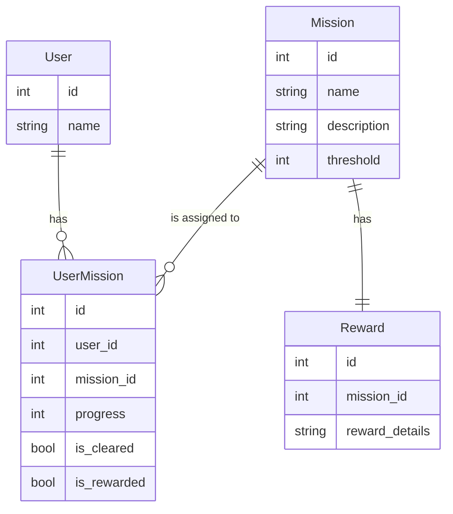
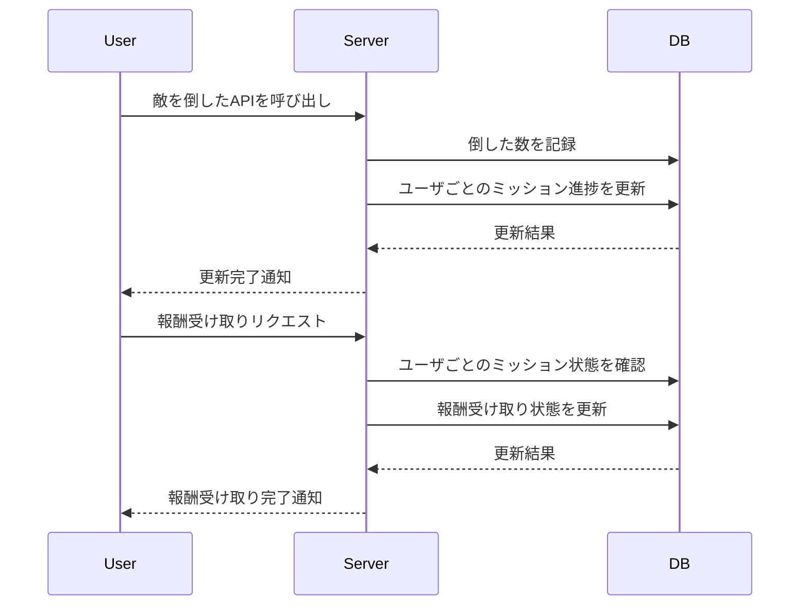

## はじめに

ソーシャルゲーム（以下、ソシャゲ）において、ミッションシステムはユーザのモチベーションを維持する重要な仕組みです。本記事では、Go言語を用いて、シンプルなミッションシステムを設計・実装する方法を解説します。

今回は以下の要件を満たす最小構成のシステムを構築します。

## 最小構成のミッション

### 要件
1. **敵を倒した数をカウントする**
   - 敵を倒すたびにAPIを呼び出し、倒した数を記録する。
   - 記録された数に応じてミッションの進捗を更新する。
   - 進捗がミッションの基準値（threshold）に達したらミッションクリアとする。

2. **報酬の受け取り**
   - ユーザ操作をトリガーに報酬を受け取る。
   - 報酬を受け取ったらミッションを「受け取り済み」にする。

3. **データ構造**
   - ユーザ、ミッション、ユーザごとのミッション進捗、報酬の4つのエンティティを管理。

4. **シンプルな構成**
   - 最小限のコードとシーケンスで実現。

### データ構造

以下は、ミッションシステムのデータ構造を表すER図です。



### シーケンス

以下は、敵を倒した際にユーザごとのミッション進捗を更新し、報酬を受け取るまでのシーケンスを示します。



## 実装

### モデル定義

以下は、Go言語でのモデル定義例です。

```go
package main

type User struct {
	ID   int
	Name string
}

type Mission struct {
	ID          int
	Name        string
	Description string
	Threshold   int
}

type UserMission struct {
	ID         int
	UserID     int
	MissionID  int
	Progress   int  // 0-100
	IsCleared  bool
	IsRewarded bool
}

type Reward struct {
	ID           int
	MissionID    int
	RewardDetails string
}
```

### 敵を倒した際の処理

```go
func EnemyDefeated(userMissions []UserMission, missions []Mission) {
	for i := range userMissions {
		mission := findMissionByID(missions, userMissions[i].MissionID)
		UpdateUserMissionProgress(&userMissions[i], mission, 10) // 例: 1体倒すごとに10%進捗
	}
}

func findMissionByID(missions []Mission, id int) Mission {
	for _, mission := range missions {
		if mission.ID == id {
			return mission
		}
	}
	return Mission{} // デフォルト値を返す
}
```

### ユーザごとのミッション進捗更新処理

```go
func UpdateUserMissionProgress(userMission *UserMission, mission Mission, progressIncrement int) {
	userMission.Progress += progressIncrement
	if userMission.Progress >= mission.Threshold {
		userMission.Progress = mission.Threshold
		userMission.IsCleared = true
	}
}
```

### 報酬受け取り処理

```go
func ClaimReward(userMission *UserMission, reward Reward) {
	if userMission.IsCleared && !userMission.IsRewarded {
		// 報酬をユーザに付与する処理
		println("Reward granted:", reward.RewardDetails)
		userMission.IsRewarded = true
	} else {
		println("Reward cannot be claimed.")
	}
}
```

## おわりに

本記事では、Go言語を用いてシンプルなミッションシステムを設計・実装しました。ユーザごとのミッション進捗を管理する仕組みを導入し、ミッションごとに基準値（threshold）を設定することで、柔軟な設計を実現しました。次回は、複雑な条件を持つミッションや、複数種類の報酬を扱う拡張例について解説します。
